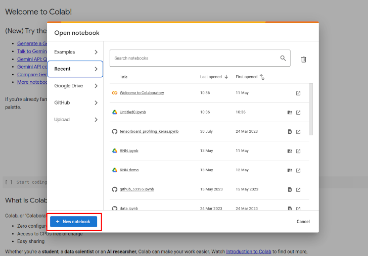
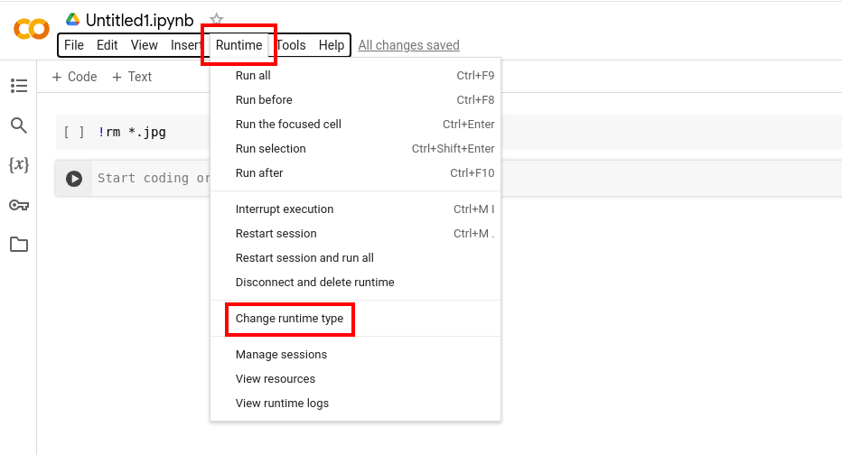
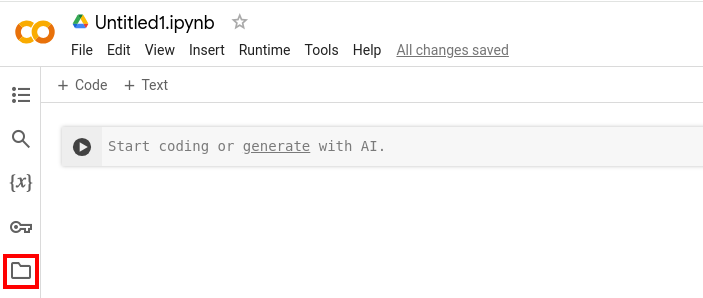
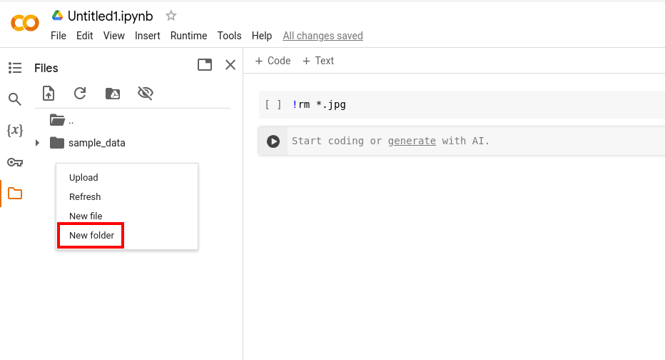
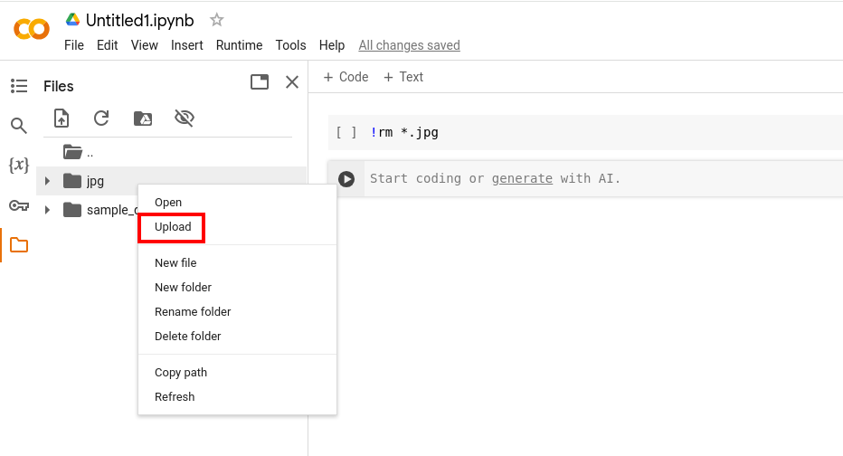

## NOTE!!
Sometimes github struggles to visualize jupyter notebook files. If you try clicking the file guide.ipynb and nothing renders (except possibly an error message), go to [https://nbviewer.jupyter.org/github/estenhl/flowers/blob/master/guide.ipynb](https://nbviewer.jupyter.org/github/estenhl/flowers/blob/master/guide.ipynb) to view the file through Jupyters own notebook viewer.

# Flower species classification
This repo contains the basic building blocks for creating an image classification model for recognizing flowers of various species. It exists as an extension of [this](https://www.tekna.no/kurs/workshop-introduksjon-til-maskinlaring-48133/) machine learning workshop, and preceeding/subsequent variants, hosted by [Tekna](https://www.tekna.no). The repo consists of three main components:

1. The slides used in the workshop
2. A fully working guide implemented as a Jupyter Notebook
3. This README, which also substitutes as a guide for setting up the necessary environment

Additionally there is a version of the guide implemented as six stand-alone python scripts, one per step, for users not familiar with Jupyter Notebooks.

## Setup
There are two ways of running the code present in this repo, both explained in this README:
1. [Via google colab](#google-colab-setup) (Recommended)
2. [Locally](#local-setup) (Has not been updated for a while)

<b>Note that you only need to follow one of these! If you use Google Colab, you can stop before the Local Setup-part of the guide starts</b>

### Google Colab setup
The goal of this setup is to enable you to run the [notebook](guide.ipynb) for training a classifier to differentiate between flower species in a Google Colab environment. Although Colab has support for direct links to github, we will achieve this by copying the code from the notebook (or, alternatively) the entire file, to avoid multiple people modifying the notebook in this repository simultaneously. Thus, the setup consists of these four steps:
1. Creating a Colab environment
2. Filling the environment with the packages and data we require
3. Copying over the contents of the notebook
4. Running (and modifying) the notebook

### Creating a Colab environment
1. Go to [https://colab.research.google.com/](https://colab.research.google.com/) and click the blue button in the bottom left corner of the pop-up modal called "+ New notebook"



2. When the notebook has opened (it should open automatically at creation), press "Runtime"/"Kjøring" in the menu at the top, and "Change runtime type"/"Endre kjøringstype". Select T4 GPU as the Hardware accelerator/Maskingvareakselerator



### Configure the environment
In this section we will configure the prerequisites needed for the notebook.
#### Data
1. Download the dataset from [http://www.robots.ox.ac.uk/~vgg/data/flowers/17/17flowers.tgz](http://www.robots.ox.ac.uk/~vgg/data/flowers/17/17flowers.tgz) to your local computer
2. Unwrap the tarball with your favourite unzipper (usually happens automatically if you double-click the downloaded file). If you are on Windows, achieveing this requires two steps: First decompress tgz to tar, then unzip the resulting tarfile. This will create a folder called 'jpg' somewhere on your system (usually where the 17flowers.tgz-file is located when you double-click it).
3. In your Jupyter Notebook on Google Colab, click the folder-symbol on the left hand side



4. Right-click within the pop-out modal (for instance right below the 'sample-data'-folder) to create a new folder in the Google Colab-environment called 'jpg'.



5. Right-click the folder and click "Upload"/"Last opp". Navigate to the 'jpg'-folder you just downloaded locally, open it and select all the images. Click Open to upload them



6. <b>Noe that you should not start this step until all images are uploaded, which might take some time!</b>Copy the code from the file 'restructure.py' in the github-repo into a Jupyter Notebook cell and run it. The result should be a newly created folder 'flowers' (it can take some time before it pops up, be patient. If nothing happens you can also click "Refresh"/"Last inn" again), with subfolders 'train' and 'val': Going deeper, each of these should have a subfolder for each flower species, where the images reside.

#### Environment
1. Install tensorflow by creating a new Jupyter Notebook cell and run the code

```
!pip install tensorflow
```

### Local setup
The goal of this setup is creating an environment where we can run the code written in the guide. To achieve this goal there are two necessary prerequisites:

- A working Python 3 environment with Tensorflow and Keras installed
- A folder containing the dataset structured [as we want it](#preparing-the-dataset)

Additionally there is a brief introduction to jupyter notebooks, for those wanting to run the guide.

#### Configuring the environment
Setting up our environment means installing Python and all the packages we will be needing for this project. In this guide we are going to use [conda](https://conda.io) as an environment manager and [pip](https://pypi.org/project/pip/) as a package manager. There is, however, a wide variety of options out there, but as long as you are able to run the [sanity check](#environment-sanity-check) you should be good.

##### Installing conda
Conda is a package, dependency and environment manager for several languages, but in this project we will take advantage of the environment management capabilities. We will be using a version called Miniconda, which is installed by downloading and running a bash-script. Note that both the URL and the name of the script depend on your operating system.

###### macOS and Linux
<b>Note!!: Users with newer macs with M1 or M2 chips need to follow a more complex installation pipeline for tensorflow seen [here](https://developer.apple.com/metal/tensorflow-plugin/)</b>

macOS: https://repo.anaconda.com/miniconda/Miniconda3-latest-MacOSX-x86_64.sh

Linux: https://repo.anaconda.com/miniconda/Miniconda3-latest-Linux-x86_64.sh

```
$ wget <url>
$ sh Miniconda3-latest-<OS>-x86_64.sh
```

<b>NOTE!! If you get the message ```wget: command not found```you don't have wget installed, and should instead open and download the script through a browser</b>

Running the script will trigger a bunch of prompts, one of which is

```
Do you wish the installer to initialize Miniconda3 by running conda init? [yes|no]
```

where we recommend you to answer yes. Once the installer finishes the installation of Miniconda, Python and pip are ready for use.

###### Windows
The miniconda installer for windows can be downloaded from
https://conda.io/en/latest/miniconda.html

Follow the installation guide until it is completed. Open the "Anaconda Prompt" from your start menu. If you are using Linux, you should use the terminal to execute the following commands, on Windows you should use the "Anaconda prompt".

##### Creating the environment
We can create an environment with our newly installed conda installation using the command ```conda create```. We do, however, have to source the .bashrc (or .bash_profile for Mac users) file modified in the previous step. This is not nessecary on Windows:

Linux:
```
$ source ~/.bashrc
```
macOS:
```
$ source ~/.bash_profile
```
Next, we run the command that creates a new environment. Here we name it "ml" and use the newest Python version 3.10.
```
$ conda create --name ml python=3.10
```
Then, the new environment has to be activated.
```
$ conda activate ml
```
If everything went as intended the command line prompt should now be prefixed with the name of the environment.

```
(ml) $ .
```

##### Installing packages

The most important package needed for this project is Tensorflow, which can be installed through pip. Additionally we will install matplotlib and PIL for interacting and showing images.

```
(ml) $ pip install tensorflow
(ml) $ pip install matplotlib
(ml) $ pip install scipy
```

We also recommend installing Jupyter to be able to run the guide as a notebook:

```
(ml) $ pip install jupyter
```

##### Environment sanity check
We can check that everything works as it should by importing tensorflow in Python:

```
(ml) $ python -c "import tensorflow;print(tensorflow.__version__)"
```

If this runs without anything failing horribly (warnings are OK!), and you get printed the version 2.10 (or greater), you are all set up.

Note that whether or not this setup runs smoothly depends heavily on what already exists on your OS. Typical problems relate to image-specific libraries used by tensorflow. If you run into trouble you should get far by googling, or by sending me an email at estenleonardsen@gmail.com.

##### Known issues
###### macOS M1/M2
<b>Problem:</b> Getting some variant of the following error message when importing tensorflow
```
RuntimeError: module compiled against API version 0x10 but this version of numpy is 0xf
ImportError: numpy.core._multiarray_umath failed to import
ImportError: numpy.core.umath failed to import
```
<b>Solution:</b> Upgrade numpy
```
pip install numpy --upgrade
```

#### Preparing the dataset
The dataset we will be using consists of images of flowers, 17 species with 80 samples each, and was created by the Visual Geometry Group at the University of Oxford. For later convenience we want the dataset structured as follows:

- Two folders, called train and val, each containing
- 17 folders, one per species, each containing
- A set of images of of flowers of the given species

We will be using 65 images per species for training and 15 images per species for validation.

##### Downloading the dataset
Clone (download) the Flowers guide from https://github.com/estenhl/flowers to your machine. If you have installed git, you can ```git clone``` it, otherwise you can visit the GitHub web site, press either Download or Raw, and save the file to a local folder. This folder will now be your repo's root folder.

```
(ml) $ git clone git@github.com:estenhl/flowers.git
```

(If you are struggling cloning the repo, try using HTTPS instead of SSH. You can toggle this under the "Clone or download" button at the top of this page)

If you are a Windows user wanting to do this through the terminal, you must download and install wget, for instance from https://eternallybored.org/misc/wget/ (version 1.20).

The dataset can now be downloaded and unzipped into this repo's root folder as follows:

```
(ml) $ cd flowers
(ml) $ wget http://www.robots.ox.ac.uk/~vgg/data/flowers/17/17flowers.tgz
(ml) $ tar -xvzf 17flowers.tgz
```
or by downloading the zipped file from http://www.robots.ox.ac.uk/~vgg/data/flowers/17/17flowers.tgz
and extracting the files into this repo's root folder.

#### #Restructuring
The newly downloaded dataset is structured by having the first 80 images belonging to the first species, the next 80 images to the second, and so on. For the sake of simplicity, we want to change this structure. By executing the script ```restructure.py``` (found in this repo) in the same folder as ```jpg```, the images will be structured as described in [Preparing the dataset](README.md#preparing-the-dataset). This step can also be done manually. If you don't have git, download the file from https://github.com/epimedai/flowers/blob/master/restructure.py into the repo's root folder and run it:

```
(ml) $ python restructure.py
```

Make sure that the newly created folder is called ```flowers``` (this will happen automatically after running ```restructure.py```) and is placed in the same directory as this guide, i.e. root folder of this repo. When this is the case you are ready to go!

### Jupyter notebooks
[Jupyter notebook](http://www.jupyter.org) is a web application for running and sharing code and documentation in a user friendly and readable format. If you installed jupyter as defined [here](#installing-packages) you are all set up to start using notebooks. To start, run jupyter from the terminal (note: You should be in the folder where guide.ipynb is located, which should be the root folder of this repo):

```
(ml) $ jupyter notebook
```

If you open [http://localhost:8888](http://localhost:8888) you should see the file-structure of the folder where you run the command, and if any .ipynb-files (such as the guide) exists, simply click them to get started.

**WINDOWS ISSUES**

You might experience some problems starting the kernel when you open the notebook. First, be sure that you are running the environment with administrator rights (right click on cmd, or conda-terminal, and click "run as administrator"). If you get [this](https://stackoverflow.com/questions/49326164/jupyter-notebook-dead-kernel) error, follow the answer given. If not, you can try to uninstall the following packages:

+ ipykernel
+ ipython
+ jupyter_client
+ jupyter_core
+ traitlets
+ ipython_genutils

Clean conda's cache by running ```conda clean -tipsy```. Then, install the packages again.
